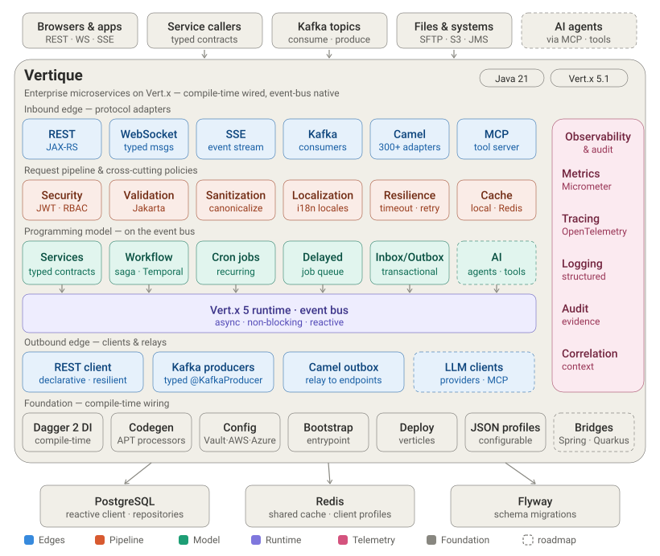
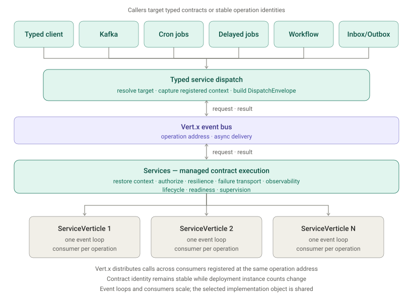

<!--
SPDX-FileCopyrightText: 2026 Koivisto Capital Oy
SPDX-License-Identifier: EUPL-1.2
-->

# Architecture

Vertique is a Java 21 multi-module Maven framework built around Vert.x. It uses
compile-time code generation and Dagger dependency injection to keep application
wiring explicit and reflection-light.

## Platform overview



The overview keeps the main capabilities at the same level: Services supplies typed contract
execution, while workflows, Kafka, cron, delayed jobs, and inbox/outbox compose with it where they
need to invoke an operation. The event-bus and service-verticle mechanics are shown separately
below so the platform view stays readable.

## Dependency direction

Dependencies flow from application-facing capabilities toward smaller foundation
modules:

```text
examples and application composition
        |
REST, services, jobs, workflows, Kafka, observability
        |
resilience, security, configuration, persistence, context propagation
        |
core and JSON foundations
```

`vertique-resilience` owns the canonical timeout, retry, and circuit-breaker vocabulary, immutable
declaration metadata, and retry contracts shared by Services, REST clients, jobs, and code
generation. It depends on `vertique-core`; core remains independent of resilience so foundation
consumers do not acquire policy-specific API.

The optional `vertique-micrometer-resilience` adapter consumes only the resilience observer SPI and
the shared Micrometer registry. It stays outside the runtime so resilience execution remains free of
telemetry-library dependencies.

`vertique-json-schema` owns transport-neutral Java `Type` -> JSON Schema 2020-12
generation, built on Victools. It depends only on `vertique-core` plus Jackson,
Victools, Jakarta Validation, and Swagger annotations — it has no dependency on
REST, MCP, Vert.x, or Dagger. `vertique-rest-validation` consumes it for body-type
schema synthesis while keeping REST-owned loose-parameter assembly to itself.
Dependency direction stays one-way into the schema module: neither `vertique-core`
nor `vertique-json` depends on it.

`vertique-mcp-core` owns the transport-neutral MCP lifecycle and extension contracts.
It depends on foundation and security APIs, never HTTP, protocol, observability, or
enterprise audit implementations. `vertique-mcp-server` owns the Router-mounted MCP
transport composition and consumes that core API plus the existing REST security
seams; observer adapters depend on the neutral MCP core contracts rather than on the
server implementation. This keeps the protocol transport and its optional extensions
on the application-facing side of the dependency direction.

The MCP request path is deliberately one adapter pipeline rather than a parallel application
stack:

```text
Streamable HTTP request
        |
bounded JSON-RPC decode and protocol negotiation
        |
shared identity + SecurityPolicyEnforcer decision
        |
generated schema, input processing, and direct tool invocation
        |
bounded output validation and terminal lifecycle observation
```

Generated invokers retain the selected application JSON profile for schema, materialization, and
bounded structured-output writing. The server owns byte and token budgets and terminal settlement;
neutral lifecycle contracts in `vertique-mcp-core` let metrics, tracing, and deliberately selected
application adapters observe outcomes without importing protocol implementation types. The release
claim is supported-scope conformance for the final `2026-07-28` discovery, tool-list, and tool-call
surface documented by the MCP modules.

Foundation modules do not import higher-level capabilities. Adapter modules depend
on the neutral API or SPI owned by the producer module they observe or extend.
The internal reactor parent, `vertique-parent`, enforces this repository boundary
during Maven validation, including transitive dependencies. Applications instead
inherit the consumer-safe `vertique-app-parent` described below.

Cache support follows the same one-way boundary: `vertique-cache-core` owns
provider-neutral cache contracts and consumes `vertique-aop` and `vertique-core`;
the Caffeine and Redis provider modules depend on that neutral core. Shared Redis
connection profiles and client lifecycle belong to `vertique-redis-core`, which is
independent of cache-specific behavior so other Redis-backed capabilities can reuse it.

Rate limiting follows the same one-way boundary: `vertique-rate-limit-core` owns the
programmatic quota-admission API, the policy and key models, and the in-process
LOCAL engine, and depends only on `vertique-core`, `vertique-context`, and
`vertique-security-core` — it never depends on Redis, REST, AOP, or either
observability adapter. Every adapter depends on core and never the reverse:
`vertique-rate-limit-aop` layers the transport-neutral `@RateLimited` annotation on
the generic AOP proxy machinery (never on REST, so the annotation is reachable from
services, REST resources, and future MCP tools alike); `vertique-rate-limit-redis`
layers the CLUSTERED Bucket4j/Redis engine on `vertique-redis-core`;
`vertique-rest-rate-limit` layers 429/503 HTTP mapping and an optional
pre-authorization edge admission middleware on `vertique-rest-core`, with a narrow
compile dependency on `vertique-rest-security` for the captured client-origin type
only; and `vertique-micrometer-rate-limit`/`vertique-opentelemetry-rate-limit` layer
metrics and tracing on the core observer SPI. `vertique-codegen-rate-limit`
validates `@RateLimited` declarations at compile time and generates no sources.
`vertique-codegen-resilience` similarly validates `@Resilient` and its declaration
annotations at compile time, including proxyability and services double-wrap
guardrails, and generates no sources.
Bucket4j itself is a private implementation dependency of core and the Redis
adapter; it never appears in a public signature of any rate-limit artifact.

## Compile-time wiring

Annotation processors under `vertique-codegen` generate Dagger bindings, service
dispatch metadata, JAX-RS resource registration, REST client proxies, workflow
metadata, event bindings, and AOP proxies. Generated bindings feed the same Dagger
component graph as hand-written modules, so missing and duplicate bindings fail at
compile time.

The standalone `vertique-app-parent` is the public Maven boundary for applications. It
imports `vertique-bom` and places only Dagger plus the dependency-only
`vertique-codegen-all` facade on the compiler processor path. The facade resolves the
closed set of Vertique-owned processor leaves, including cache code generation, transitively; those leaves remain build
tools and never become application runtime dependencies. Custom-parent consumers use
the same boundary explicitly by importing the BOM and configuring the same two
versionless processor paths. Lombok is outside that default boundary and requires an
explicit application opt-in.

## Runtime composition

Applications assemble a root Dagger component from the capabilities they use.
Lifecycle contributions are ordered explicitly for configuration, validation,
infrastructure, service dispatch, and edge transports. Vert.x `Future` values carry
asynchronous completion; blocking work must be placed on an explicit worker
boundary.

Cross-cutting behavior uses neutral, ordered extension points. Producer modules own
their events and SPIs, while metrics, tracing, logging, and application extensions
contribute adapters without reversing dependency direction.

### Services runtime detail



Application code calls a generated, injectable typed client through the service contract. Kafka,
cron, delayed jobs, workflows, and outbox delivery resolve stable operation identities. Both paths
enter the same dispatch runtime, which captures registered context, sends over the Vert.x event
bus, and returns the result or transported failure. The receiving side restores the dispatch
context and invokes one of the configured service verticle instances on its own Vert.x event loop.

## Starter aggregates

The `vertique-starter` family publishes static Dagger aggregate modules that compose a fixed set of
framework capabilities behind one class name, so an application component names one aggregate
instead of repeating a capability's module list. Aggregate membership and each starter's direct
dependency ledger are release-line compatibility surfaces: they change only as a
compatibility-affecting release, never as an internal refactor.

| Starter | Composes | Direct dependencies |
|---|---|---|
| `vertique-starter-core` | the Vert.x seam, config parsing, verticle deployment, and core lifecycle steps | `vertique-application`, `vertique-core`, `vertique-config-core`, `vertique-deploy` |
| `vertique-starter-rest` | the core starter plus JAX-RS routing, request validation, the REST security runtime, and management | `vertique-starter-core`, `vertique-management`, `vertique-rest-jaxrs`, `vertique-rest-security`, `vertique-rest-validation` |
| `vertique-starter-services` | the core starter plus the event-bus dispatch runtime and management | `vertique-starter-core`, `vertique-management`, `vertique-services` |
| `vertique-starter-postgresql` | PostgreSQL connection pooling and application-owned Flyway migration wiring | `vertique-db-core`, `vertique-db-postgresql`, `vertique-db-flyway` |

Every starter stops at composition: launcher choice, test libraries, deployment entries, and the
annotation-processor-generated application module stay explicit application decisions, never
supplied by a starter. `vertique-starter-postgresql` is an independent capability rather than an
application foundation — it is composed alongside an application starter, not in place of one, and
reaches no `Vertx` binding on its own.

The `vertique-starter` POM aggregator and the `vertique-starter-integration-tests` module are
internal, non-consumable reactor infrastructure: neither is part of the BOM or the module index.

## Application archetypes

The `vertique-archetype` family publishes three independently runnable Maven archetypes, each
generating a functional starting application by composing exactly the starter modules its persona
needs. Generation replaces hand-assembling framework modules with one `archetype:generate`
invocation per persona; every generated command is documented in the generated project's own
README.

| Archetype | Persona | Starters composed |
|---|---|---|
| `vertique-archetype-rest` | REST API application | `vertique-starter-rest` |
| `vertique-archetype-services` | Contract-based services application | `vertique-starter-services` |
| `vertique-archetype-rest-postgresql` | PostgreSQL-backed REST application | `vertique-starter-rest`, `vertique-starter-postgresql` |

Each archetype's own README documents its exact `archetype:generate` command; the generated
PostgreSQL REST project additionally requires a reachable Docker daemon to run its integration
test. The `vertique-archetype` POM aggregator is internal, non-consumable reactor infrastructure,
the same as the starter family's own aggregator: it is not part of the BOM or the module index.

## Module documentation

The [module index](modules.md) links to the canonical reference document packaged
with each consumable artifact. Those documents define public configuration, API and
SPI contracts, lifecycle behavior, dependencies, and verification guidance.
