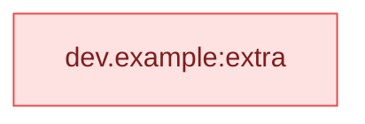

## Module graph changes

```mermaid
flowchart LR
  m_dev_example_extra["dev.example:extra"]
  classDef removed fill:#fee2e2,stroke:#ef4444,color:#7f1d1d
  class m_dev_example_extra removed
```

| Module | Change |
| --- | --- |
| `dev.example:extra` | removed |
