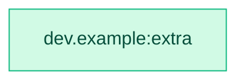

## Module graph changes

Reactor version: `1.0.0` -> `2.0.0`

```mermaid
flowchart LR
  m_dev_example_extra["dev.example:extra"]
  classDef added fill:#d1fae5,stroke:#10b981,color:#064e3b
  class m_dev_example_extra added
```

| Module | Change |
| --- | --- |
| `dev.example:extra` | added |
