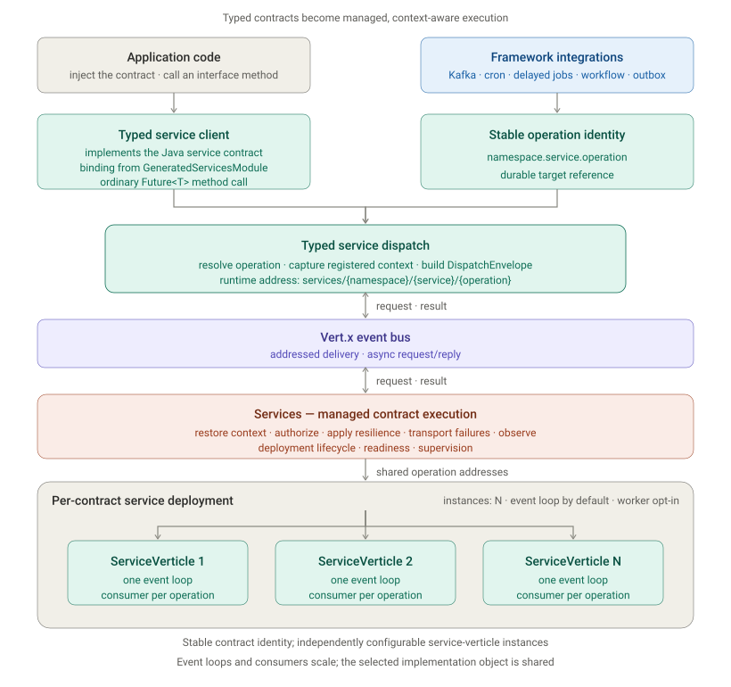

<!--
SPDX-FileCopyrightText: 2026 Koivisto Capital Oy
SPDX-License-Identifier: EUPL-1.2
-->

# Services Module

> **Status:** Stable
> **Package:** `dev.vertique.services`
> **Artifact:** `vertique-services`
> **Depends on:** core, context, correlation, deploy, logging, security-core, security-runtime

`vertique-services` is Vertique's contract-based execution model. Applications define typed
operations as annotated Java interfaces, implement them as ordinary injectable classes, and inject
the contract itself wherever an operation must be called. The generated services Dagger module
provides a singleton typed client for each eligible contract. Vertique captures registered dispatch
context, routes the invocation over the Vert.x event bus, restores that context on receipt, and owns
service lifecycle, supervision, authorization, resilience, failure transport, and observability.

Each contract runs on one or more independently configurable `ServiceVerticle` instances. Every
instance has its own Vert.x event loop and registers consumers at the contract's operation
addresses, so instance count scales consumers and concurrent execution. The instances share the
single selected implementation object stored in the contract entry; scaling does not create isolated
handler state, so implementations must remain safe for concurrent calls. Kafka listeners, cron
schedules, delayed jobs, workflows, and outbox relays can resolve and invoke explicitly identified
operations through their stable target ids.

---

## When To Use It

Use this module when an application needs:

- a typed boundary between independently testable application capabilities;
- asynchronous `Future<T>` request/reply without exposing event-bus addresses to callers;
- service-level timeout, retry, circuit-breaker, authorization, or observability policies;
- isolated service deployment and supervision within one Vert.x application; or
- a durable service-operation identity for Kafka, cron, delayed jobs, workflows, or outbox
  delivery.

For a simple function call within one cohesive component, prefer a normal injected Java interface.
For communication between processes, use a network or broker integration with an explicit
serialization and compatibility contract.

---

## Core Concepts



The Java interface is both the caller's dependency and the framework contract. Generated Dagger
wiring supplies the typed client; service integrations use the same operation metadata through a
stable identity. Both paths converge on the dispatch runtime and the managed service verticles.

### Contracts and operations

Annotate an interface with `@ServiceContract`. Its `namespace` and `value` form the logical service
identity. Each method is an operation and must return `Future<T>` or `Future<Void>`.

`@ServiceOperation("id")` gives an operation a durable identity. Without it, the Java method name is
used for runtime routing and the operation cannot be resolved as a stable target.

| Declaration | Runtime address | Stable target id |
|---|---|---|
| namespace `integration`, service `users`, operation `find` | `services/integration/users/find` | `integration.users.find` |
| no namespace, service `users`, operation `ping` without `@ServiceOperation` | `services/users/ping` | none |

Changing a namespace, service name, or explicit operation id breaks durable references that store
the stable target id.

### Handler implementations

The recommended server shape implements `ServiceHandler<Contract>` instead of the contract itself.
Handler methods match contract methods by Java method name and may add framework-provided parameters
such as `SecurityContext`. This keeps caller-visible contracts free of server-only context.

Direct implementations (`implements Contract`) remain supported. Do not register both a direct
implementation and a handler for the same contract.

### Generated registration and typed clients

The services annotation processor discovers service implementations and source-root service
contracts, then generates `GeneratedServicesModule`. Its `@Provides @IntoSet` contributor bindings
register compile-time-validated contract metadata and implementation providers. Its
`@Provides @Singleton` typed-client bindings call `ServiceClientFactory.create(Contract.class)`,
making each eligible contract directly injectable. Add that generated module and `DispatchModule`
to the application component.

Application code normally injects the contract directly:

```java
@Inject
OrderCoordinator(FulfilmentService fulfilmentService) {
    this.fulfilmentService = fulfilmentService;
}
```

The generated provider delegates to `ServiceClientFactory.create(Contract.class)`. `create()` selects
a generated `{Contract}_ServiceClientProxy` companion when one is on the classpath — emitted by
`vertique-codegen-services` for every source-root `@ServiceContract` interface — and falls back to a
JDK dynamic proxy otherwise. Either way, the client captures dispatch context, resolves operation
metadata, and delegates transport concerns to the framework.

`ServiceClientFactory` remains available for deliberate dynamic or manual wiring. A contract
annotated `@NoAutoWire` suppresses only its generated typed-client binding, so an application-owned
`@Provides` method can bind it explicitly. `@NoAutoWire` on an implementation keeps its existing
server-registration semantics and does not suppress a valid client binding for the contract.

### Delivery semantics

Request/reply is the default. The returned future completes with the service result or a transported
failure.

`@OneWay` uses fire-and-forget delivery and is restricted to `Future<Void>`. Successful completion
means only that the message was submitted to the event bus. It does not prove that a consumer
received or processed it, and server failures cannot reach the caller.

### Reply-address delivery

`DispatchEnvelope` may additionally carry an optional reply address alongside the payload and
dispatch metadata. When one is present, the operation's outcome — success, or the final failure
after any `ServiceInterceptor` recovery — is published to that address instead of being sent back
on the originating event-bus message. This is a third delivery mode ("fire-and-report"), distinct
from both request/reply and `@OneWay`.

The reply address is a property of how an operation is dispatched, not of the operation's own
annotations: when present, it is honored regardless of whether the target method is `@OneWay`.

The jobs infrastructure (cron and delayed-job scheduling) is the framework dispatcher that uses it.
Each dispatch sets a reply address before sending, then listens for the outcome independently of
the original send — letting a scheduler hand an operation off without holding a live request/reply
future open across the operation's entire execution. The outcome — or a separate execution-timeout
timer, if none ever arrives — drives that scheduler's own completion handling: delayed-job retries
with backoff up to its configured attempt limit before dead-lettering; cron records a terminal
outcome per fire with no automatic retry, since its own recurrence produces the next execution.

`ServiceClientFactory`'s typed client never populates a reply address, for either delivery mode it
uses:

| Client delivery mode | Reply address | Outcome delivery |
|---|---|---|
| `@OneWay` | never set | Fire-and-forget; the returned future completes once the message is submitted. No outcome — success or failure — ever reaches the caller. |
| Request/reply (default) | never set | Carried back on the originating request via the event bus's own reply mechanism; the returned future completes with the service result or a transported failure. |

### Execution and lifecycle

Each registered service contract is deployed as one or more `ServiceVerticle` instances according
to `services.contracts.<namespace>.<name>.instances`. Vert.x deploys every configured instance on
its own event loop; the instances register consumers for the same operation addresses and share
the work. Operations run on the event loop by default; blocking handlers must use worker deployment
(`worker: true`) or move blocking work behind an appropriate asynchronous boundary.

`DispatchModule` contributes service startup and shutdown steps. Applications using the standard
Vertique lifecycle do not call a deployment manager directly.

---

## Getting Started

### 1. Define a contract

```java
package com.example.users;

import dev.vertique.resilience.annotation.Retry;
import dev.vertique.resilience.annotation.Timeout;
import dev.vertique.services.OneWay;
import dev.vertique.services.ServiceContract;
import dev.vertique.services.ServiceOperation;
import io.vertx.core.Future;

@ServiceContract(namespace = "accounts", value = "users")
public interface UserService {

    @ServiceOperation("display-name")
    @Timeout(2_000)
    @Retry(maxRetries = 2, delayMs = 50)
    Future<String> displayName(String userId);

    @OneWay
    @ServiceOperation("invalidate-cache")
    Future<Void> invalidateCache(String userId);
}
```

At most one parameter may be a domain payload. A contract may declare dispatch-context values, but
server-only values such as `SecurityContext` are better added to a `ServiceHandler` method.

### 2. Implement a handler

```java
package com.example.users;

import dev.vertique.security.SecurityContext;
import dev.vertique.services.ServiceHandler;
import io.vertx.core.Future;
import jakarta.inject.Inject;

public final class UserServiceHandler implements ServiceHandler<UserService> {

    @Inject
    public UserServiceHandler() {}

    public Future<String> displayName(String userId, SecurityContext securityContext) {
        return Future.succeededFuture("User " + userId);
    }

    public Future<Void> invalidateCache(String userId) {
        return Future.succeededFuture();
    }
}
```

Handler matching is strict:

- method names match the Java symbols on the contract, not `@ServiceOperation` values;
- contract and handler overloads are rejected;
- payload parameter order and types must match;
- extra handler parameters must be framework-injectable; and
- generic `Future<T>` return types must match exactly.

Registration failures are aggregated and reported at startup rather than discovered on first call.

### 3. Include generated and runtime modules

```java
package com.example;

import com.example.users.GeneratedServicesModule;
import dagger.Component;
import dev.vertique.application.VertiqueApp;
import dev.vertique.application.VertiqueApplicationComponent;
import dev.vertique.starter.services.ServicesApplicationModule;
import jakarta.inject.Singleton;

@VertiqueApp
@Singleton
@Component(
        modules = {
            ServicesApplicationModule.class,
            GeneratedServicesModule.class
        })
interface ApplicationComponent extends VertiqueApplicationComponent {}
```

`ServicesApplicationModule` includes `DispatchModule` plus the core lifecycle and management
foundation. Applications using `vertique-app-parent` receive the processor facade through the
supported build boundary. Custom-parent builds configure `vertique-codegen-all` as described by the
public packaging guide. If generated registration does not fit a deliberate custom binding,
annotate the implementation with `@NoAutoWire` and contribute it manually to
`@Services Set<Object>`. Because `@NoAutoWire` is source-retained, applications using that opt-out
also declare `dev.vertique:vertique-codegen-core` with `provided` scope as documented in
`docs/packaging.md`.

### 4. Inject and use a client

```java
package com.example.users;

import jakarta.inject.Inject;

public final class UserCoordinator {

    private final UserService users;

    @Inject
    public UserCoordinator(UserService users) {
        this.users = users;
    }
}
```

Inject and call `UserService` like any other asynchronous dependency. Do not construct event-bus
addresses or generated proxy classes in application code.

---

## Key Classes

### `@ServiceContract`, `@ServiceOperation`, and `@OneWay`

These annotations define the public service protocol:

| Type | Purpose | Important constraint |
|---|---|---|
| `@ServiceContract` | Stable namespace and service name | Only interfaces are contracts |
| `@ServiceOperation` | Stable operation id and address segment | Required for durable target resolution |
| `@OneWay` | Fire-and-forget operation | Method must return `Future<Void>` |

Resilience annotations from `dev.vertique.resilience.annotation` may be placed on contracts or
methods.
Method annotations override contract-level values.

### `ServiceHandler<C>`

Marker interface for an implementation that keeps framework-injected values off the caller-visible
contract. `SecurityContext` and types annotated with `@DispatchContextValue` may be added to handler
methods when a matching receive-side decoder is installed.

### `ServiceClientFactory`

`create(Class<T>)` selects a generated `{Contract}_ServiceClientProxy` companion when one is present
on the contract's classloader (emitted by `vertique-codegen-services`), preferring it over a JDK
dynamic proxy, which is used as the fallback when no companion is present. Both paths handle
`DispatchEnvelope`/`Result` encoding identically and delegate all transport to the framework; policy
enforcement happens server-side.

#### Invariants & Gotchas

**Create-time contract completeness.** Before building the proxy, `create(Class<T>)` resolves the
contract in the registry — an unregistered contract throws `IllegalArgumentException`, always
checked first — then validates that every non-static, non-`Object`-declared public method of the
contract interface has a corresponding registered operation. Each method's operation id is resolved
the same way runtime dispatch resolves it (the `@ServiceOperation` value, or the method name when the
annotation is absent) and looked up in the resolved entry's operations map. A registry superset —
extra registered operations with no corresponding interface method — is allowed. A missing operation
fails `create()` immediately with `IllegalStateException` whose message begins with the exact literal
`"Service client contract mismatch: "`, followed by the contract's fully-qualified name, the missing
operation id, and the method name.

**Companion selection.** After the completeness check passes, `create()` looks up the generated
`{Contract}_ServiceClientProxy` companion under the contract's own package, flattening any
nested-type name (`Outer.Inner` → `Outer_Inner`). An absent companion is the expected fallback and
yields the JDK dynamic proxy. A *present but broken* companion — a bad constructor, a failing static
initializer, or a linkage error — fails loudly instead of silently falling back: the constructor's
own contract-mismatch `IllegalStateException` (message prefixed with the same
`"Service client contract mismatch: "` literal) is unwrapped and rethrown unchanged, so a
baked-vs-runtime drift reports identically on both paths; any other failure is wrapped as
`"Generated service client proxy {fqn} is present but could not be instantiated"`.

**Common mistake:** a hand-built `ServiceContractContributor` entry that omits an operation the
contract interface declares now fails at `create()` time rather than only surfacing on the first
invocation of that method.

The client automatically propagates registered dispatch-context values and MDC. When a
`SecurityContext` is bound to the current Vert.x context and the matching security dispatch codecs
are installed, it is captured without an explicit contract parameter.

### `ServiceTargetResolver`

Use the injected `ServiceTargetResolver` when another subsystem must persist or later resolve a
service operation:

```java
ResolvedServiceTarget target =
        targetResolver.resolve("accounts.users.display-name");

String durableId = target.targetId();
String currentAddress = target.address();
```

Persist `targetId()`, not `address()`. Only methods with explicit `@ServiceOperation` ids appear in
the resolver.

### `DispatchModule`

Include `DispatchModule` in the application component to install dispatch, deployment, health,
context, correlation, logging, and security-event infrastructure. It also declares empty
multibindings for application extension points.

When `@RequiresAction` is used on service contracts or operations, install the authorization engine.
Vertique validates the action gates at component construction and fails closed when the required
authorization bindings are absent.

---

## Resilience

The annotations `@Timeout`, `@Retry`, `@CircuitBreaker`, and `@Bulkhead` are defined by
`dev.vertique:vertique-resilience` and enforced server-side by its common executor. Services
translates its typed operation configuration into the same resolved policy used by the server
pipeline; configuration alone never activates resilience when an operation has no annotation.

Effective policy order is timeout/circuit-breaker around retry. A configured timeout applies per
attempt. `@Retry.abortOn` wins over `retryOn`; when `retryOn` is empty, failures not matched by
`abortOn` are eligible for retry.

`@Bulkhead` limits concurrent logical executions. Its default `REJECT` mode fails immediately when
capacity is exhausted. `QUEUE` mode admits a bounded FIFO queue using `maxQueueSize` and
`queueTimeoutMs`; the permit covers the complete execution, including retries and backoff. The
annotation may be placed on the service interface or operation, with operation declarations
overriding interface declarations.

The event-bus send timeout uses operation, service, and global `sendTimeoutMs` overrides before the
resolved active execution budget plus the compatibility margin. Custom-backoff, unbounded, or
saturated budgets require one of those explicit transport timeouts. Services has no separate
bulkhead configuration; admission is enabled only by an explicit `@Bulkhead` declaration.

JSON configuration can override annotation values for an environment without changing the service
contract. Invalid values fail during startup parsing.

An operation may select a named resilience tier with `@Resilient(policy = "name")`. Services
layers the selected `resilience.policies.<name>` tier below its operation and service transport
overrides, while declaration attributes remain below the named tier and family defaults remain
last. A named tier does not activate resilience without the `@Resilient` anchor; an unknown tier
fails during graph construction rather than being silently ignored.

---

## Security and Dispatch Context

Outbound context propagation is registry-based. Installed encoders capture typed values into the
dispatch envelope; receive-side decoders restore them for the service invocation. MDC, correlation,
and security integrations use this same boundary.

Prefer a handler-only `SecurityContext` parameter:

```java
public Future<String> displayName(String userId, SecurityContext securityContext) {
    securityContext.snapshot();
    return Future.succeededFuture("User " + userId);
}
```

`@RequiresAction` adds a framework authorization gate. Authorization denials and identity-snapshot
degradation failures are non-recoverable; an application interceptor cannot turn them into a
successful dispatch.

---

### Module wiring

`DispatchModule` includes `SecurityEventsModule` from `dev.vertique:vertique-security-runtime`.
Every module it pulls in is Stable, so installing it commits an application only to Stable
wiring.

## Extension Points

### `ServiceInterceptor`

Contribute ordered cross-cutting behavior through Dagger multibinding:

```java
@Provides
@IntoSet
static ServiceInterceptor serviceMetrics(ServiceMetricsInterceptor interceptor) {
    return interceptor;
}
```

Callbacks have distinct semantics:

| Callback | Role | Can change the dispatch outcome? |
|---|---|---|
| `beforeDispatch` | Async enrichment or precondition | Yes; failure short-circuits |
| `onDispatch` | Synchronous pre-dispatch observation | No |
| `onComplete` | Observe handler outcome before recovery | No |
| `afterDispatch` | Async post-processing | No; failures are logged |
| `recoverError` | Attempt application recovery | Yes; first successful recovery wins |
| `onTerminalComplete` | Observe final post-recovery outcome | No |

Interceptors follow the `OrderedExtension` order: phase, ascending priority, then stable
`orderKey`. Use `onComplete` for the raw handler outcome and `onTerminalComplete` for the final
outcome after recovery; they are intentionally different signals.

### `ServiceExceptionMapperCustomizer`

Contribute exception translation at the service boundary:

```java
@Provides
@IntoSet
static ServiceExceptionMapperCustomizer serviceErrors() {
    return mapper -> mapper.on(
            IllegalArgumentException.class,
            error -> new IllegalStateException(error.getMessage(), error));
}
```

Customizers follow `OrderedExtension`; registrations applied later win for the same exception type.

### `ServiceContractContributor`

This advanced SPI lets another framework module register service-shaped handlers without
`@ServiceContract` discovery. Build entries with `ServiceContractEntries`; do not instantiate
dispatch metadata records directly. Contributors participate in the same collision validation,
deployment, policies, and lifecycle as application contracts.

Use generated service registration for normal applications.

### Manual `@Services` contribution

Manual registration remains available for implementations that intentionally opt out of codegen:

```java
@Provides
@IntoSet
@Services
static Object userService(UserServiceHandler handler) {
    return handler;
}
```

This is an explicit fallback, not an additional registration to combine with the generated entry.

---

## Configuration

Configuration lives under `services`. The empty namespace uses `_` as its configuration key.

```json
{
  "services": {
    "sendTimeoutMs": 30000,
    "contracts": {
      "accounts": {
        "users": {
          "instances": 2,
          "worker": false,
          "sendTimeoutMs": 10000,
          "supervision": {
            "maxRestarts": 5,
            "withinMs": 60000,
            "initialBackoffMs": 1000,
            "maxBackoffMs": 30000
          },
          "operations": {
            "display-name": {
              "sendTimeoutMs": 5000,
              "timeout": {
                "valueMs": 2000
              },
              "retry": {
                "maxRetries": 2,
                "delayMs": 50,
                "backoffMultiplier": 2.0,
                "maxDelayMs": 1000
              },
              "circuitBreaker": {
                "maxFailures": 5,
                "timeoutMs": 2000,
                "resetTimeoutMs": 30000
              }
            }
          }
        }
      }
    }
  }
}
```

| Key | Default | Constraint |
|---|---:|---|
| `services.sendTimeoutMs` | `30000` | greater than 0 |
| `contracts.{ns}.{name}.instances` | `1` | at least 1 |
| `contracts.{ns}.{name}.worker` | `false` | boolean |
| `contracts.{ns}.{name}.sendTimeoutMs` | global value | greater than 0 |
| `supervision.maxRestarts` | `5` | see deploy supervision contract |
| `supervision.withinMs` | `60000` | milliseconds |
| `supervision.initialBackoffMs` | `1000` | milliseconds |
| `supervision.maxBackoffMs` | `30000` | milliseconds |
| `operations.{op}.sendTimeoutMs` | service value | greater than 0 |
| `operations.{op}.timeout.valueMs` | annotation value | greater than 0 |
| `operations.{op}.retry.maxRetries` | annotation value | at least 0 |
| `operations.{op}.retry.delayMs` | annotation value | at least 0 |
| `operations.{op}.retry.backoffMultiplier` | annotation value | at least 1.0 |
| `operations.{op}.retry.maxDelayMs` | annotation value | at least 0 |
| `operations.{op}.circuitBreaker.maxFailures` | annotation value | at least 1 |
| `operations.{op}.circuitBreaker.timeoutMs` | annotation value | greater than 0 |
| `operations.{op}.circuitBreaker.resetTimeoutMs` | annotation value | greater than 0 |

Operation keys are resolved operation ids: the `@ServiceOperation` value when present, otherwise the
Java method name.

---

## Failures, Constraints, and Common Mistakes

- Service contracts must be interfaces and operations must return parameterized `Future<T>`.
- Contract and handler overloads are rejected; operation identity must be unambiguous.
- A contract operation has at most one payload parameter. `DispatchEnvelope<?>` is a transport
  wrapper and is not a valid contract parameter.
- `@OneWay` is best-effort and does not provide delivery or processing confirmation.
- Do not block the event loop. Configure a worker service only when the handler genuinely performs
  blocking work.
- Do not persist event-bus addresses. Persist stable target ids from explicitly annotated
  operations.
- Do not bind a generated and manual implementation for the same contract.
- Do not use interceptor recovery for authorization or identity-degradation failures; Vertique
  marks those failures non-recoverable.
- A hand-built `ServiceContractContributor` entry that omits an operation the contract interface
  declares now fails at `ServiceClientFactory.create()` time, not only on the first invocation of
  that method.

Transport failures are enriched as service failures:

| Failure | Meaning |
|---|---|
| `ServiceTimeoutException` | request/reply exceeded the effective send timeout |
| `ServiceUnavailableException` | supervisor unavailable or no event-bus handler |
| `ServiceDispatchException` | other service transport failure |
| `ServiceRegistrationException` | one or more contract/handler validation failures at startup |

---

## Verification

For a focused module check from the repository root:

```bash
./mvnw -ntp -pl vertique-services -am test
```

The public examples `examples/vertique-example-services` and
`examples/vertique-example-services-codegen` demonstrate generated registration, handler
implementations, typed clients, authorization, and lifecycle wiring.

---

## Dependencies

- `dev.vertique:vertique-core` — async results, event-bus envelopes, lifecycle, and ordered
  extensions.
- `dev.vertique:vertique-resilience` — canonical resilience annotations, declaration metadata, and
  retry contracts.
- `dev.vertique:vertique-context` — typed dispatch-context capture and restoration.
- `dev.vertique:vertique-correlation` and `dev.vertique:vertique-logging` — correlation and MDC
  propagation.
- `dev.vertique:vertique-deploy` — verticle deployment, supervision, and lifecycle integration.
- `dev.vertique:vertique-security-core` and `dev.vertique:vertique-security-runtime` — security
  context, action authorization, identity-degradation policy, and security events.
- `io.vertx:vertx-core` — event-bus transport; resilience execution is owned by
  `vertique-resilience`.
- Dagger and Jakarta Inject — application wiring and extension multibindings.
